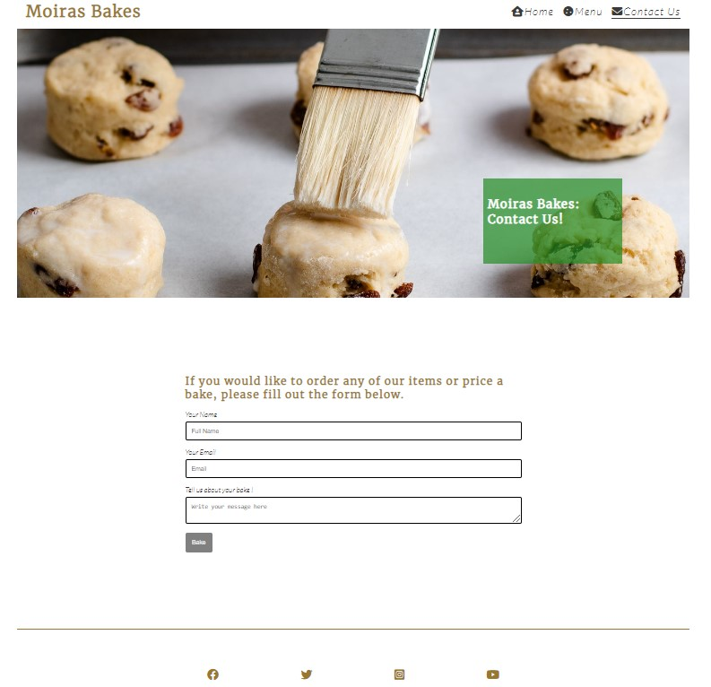

# Moiras Bakes

## Your one stop shop for baking in Athy, Co Kildare

[View the deployed webpage here ](https://aodhank25.github.io/Moiras-Bakes-/index.html)

This is a webpage for my mother's newly started hobby bakery business in Athy ,Co Kildare. The website features a home page, a sample menu, and a contact page for potential customers to reach out with queries.

#### **The business goals of the website are ;**

 - Gain new customers.

 - Build brand awareness and showcase unique skills. 

 - Provide new customers with samples of products they could purchase.

 - Give customers an easy method to communicate with Moira.

 - Allow existing customers to gain knowledge of new products on offer. 

 - Provide details of the bakery's opening hours and location. 

#### **The customer goals of the website are** 

 - Gain awareness and purchase homemade baked goods in their local town. 

 - Have an easy method to contact a trained baker in their local area. 

 - Understand what price they can expect to pay for their order. 

 - Where the bakery is based and when they are open for business. 

## UX

#### Users' Stories

##### Ideal Customer

 - Our ideal client is someone who is looking for a one-off or semi-regular baking service, such as a birthday cake or treats for a party. 

 - Is more focused on quality than price.

 - Has an idea of what they would like to order.

 - lives in Athy

#### Strategy 

- The strategy of the website is to feel minimalist and friendly, like a local homemade bakery should. As we are targeting local people, I aimed for a user-friendly design that avoided being too wordy. 

#### Scope

- We want customers to gain a feel for Moiras baking and what she has to offer. I am aiming to showcase her professional training all the while impressing with the homemade nature of the baked goods, as this is our USP. 

## Structure

The website is split into three pages. You are able to navigate between the pages by using the NAV bar at the top right of each page. The logo also brings you back to the home page if clicked.

 1. **Home page** - This page contains the opening hours and a brief description of what makes our bakery special. 

 

 

 2. **Menu**- This page outlines our guide prices and some ideas of baked goods we could provide. 

 3. **Contact us** - This page allows the potential customer to leave a message directly with Moira and allows her to respond to their requests and queries. 

#### Colour scheme

The tan colour of the logo and headers was selected to remind the user of the colour of freshly baked bread. This was matched with occasional green to showcase the fresh nature of the products on a white minimalist backdrop. 

#### Images

The images were downloaded from Google Images and resized for the purpose of this project. These will be replaced by Moiras own baking should she choose to continue with the business. 

## Features 

### Existing Features

#### Nav bar & Logo 

- This is the three page headings as mentioned above. 

- Located on all three pages. 

- The page you are on is underlined to allow you to know what page you are on. 

- The page highlights the same colour as the logo when you hover over it. 

- The logo navigation also brings the user back to the homepage if clicked. 

### Footer 

- This is the same on all three pages. 

- The footer contains links to the business's four social media accounts. 

### Hero Image

-   Each page features a hero image with a text box indicating the page title and the business name. 

- All hero images have a animation to draw in the users' attention and grab their interest in the beautifully made baked goods. 

### Contact

-   The contact page features a form for the customer to enter their name, email, and message, all required, with a submit button included as "bake" . Users are encouraged to request information about a possible bake or price on a potential order. 

### Future Features

- Adding Moira own features 

- Adding an extra page to facilitate orders and payments 

- Add videos of Moira baking to the home page. 

- Adding different pictures for the hero image depending on the  screen size of the device. 

- Add a shopping basket for selected items. 

## Technologies Used

- HTML 

- CSS

- Fontawesome 

- Google Fonts 

- freeformatter.com -  html-formatter.html

## Deploying the website

The is hosted on GitHub pages, it is deployed directly from the main branch. The server will automatically update new commits as they are pushed to the master branch. 

In order to run the above process, you will need the following, 

 1. Github account 

 2. Google Chrome Browser 

### Validator Testing

-   HTML

-No errors were returned when passing through the official  W3C validator.

-   CSS

    -   No errors were found when passing through the official Jigsaw validator

### Acknowledgements

 - The contact form inspiration was adapted from  [W3 schools contact form](https://www.w3schools.com/howto/howto_css_contact_form.asp)

 - My mentor, Brian, provided great guidance. 

 - I used the code from the Love Running coding challenge for the hero image and HTML structure. 

 